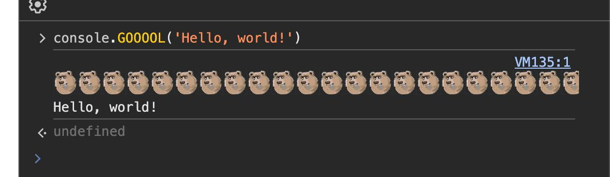

## Introduction

**GOOOOL** is a package that improves your `console.log` with `console.GOOOOL` method

Benefits of **GOOOOL**:
- Full TypeScript support
- Zero dependencies
- Full backward compatibility with console.log, it won't break anything in your project

## Quick start

```typescript
import 'gooool'

console.GOOOOL('Hello, world!')
```

## Example output



## License

The MIT License.
